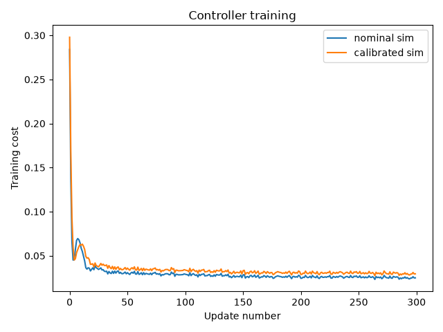

# Sim2Real Pendulum

I built this project to understand how PyTorch connects physics, learning, and control. The task is to move a pendulum to **0.6 radians** (or any position) and hold it there.

The process: **collect motion data → fit the simulator → train a controller → test it**.

The reference pendulum in `real_robot.py` is software. No physical hardware is used.

**Want to learn from the beginning? [Start here](START_HERE.md) → M0–M4.** My process is in [WORKLOG.md](WORKLOG.md).

## How it works

| File | Purpose |
|---|---|
| [sim.py](sim.py) | Simulate motion with gradients preserved |
| [calibrate.py](calibrate.py) | Fit length L and damping b to measured motion |
| [policy.py](policy.py) | Train a network to choose torque from angle error and velocity |
| [evaluate.py](evaluate.py) | Compare controllers trained in nominal and calibrated simulators |

Calibration learns **L and b**. Controller training keeps them fixed and learns **network weights and biases**. Its cost penalizes angle error and angular velocity; gradients pass through the simulator to improve the controller.

## Results

Mean absolute angle error across **256 trajectories**, using the **last 100 of 300 steps**:

| Training simulator | L | b | Holding error (rad) |
|---|---:|---:|---:|
| Nominal | 1.000000 | 0.100000 | 0.036721 |
| Calibrated | 1.199742 | 0.351047 | 0.004281 |

**Reduction: 0.032440 rad, or 88.34%.** [Full results and settings](results/m4_comparison.csv).



Each curve measures cost in its own training simulator. The table compares performance on the shared reference system. The [calibration plot](figures/m2_calibration_loss.png) separately shows fitting loss.

Calibration helped in this run. One seed and one evaluation setup do not prove reliability across other conditions or physical hardware. The final-window average also misses early motion and can hide poor individual trajectories.

## Run the project

A CPU is enough. Run from the project root—the folder containing this README:

```sh
git clone https://github.com/HEGOBAK/sim2real-pendulum.git
cd sim2real-pendulum
python3 -m venv .venv
source .venv/bin/activate
python -m pip install -r requirements.txt
python -m pytest -q
python evaluate.py
```

Windows PowerShell: use `py -m venv .venv` and `.\.venv\Scripts\Activate.ps1` for environment creation and activation.

`evaluate.py` runs calibration, both training runs, and evaluation. It replaces the CSV and training plot above. Run `python calibrate.py` separately to regenerate the calibration plot. Training may be quiet while running; use `MPLBACKEND=Agg` on macOS/Linux without a display.

| Setting | Value |
|---|---|
| Calibration | Adam; 400 updates; learning rate 0.05 |
| Controller training | Adam; 300 updates; learning rate 0.01 |
| Training batch / horizon | 32 trajectories / 150 steps |
| Training starts | Angles in [−0.1, 0.1), zero velocity |
| Training / caller evaluation seeds | 1 / 123, matching for both controllers |

Verified with Python 3.12.14, PyTorch 2.14.0, Matplotlib 3.11.2, and pytest 9.1.1. Dependencies are unpinned; numerical results may vary. The two tests check pendulum period and gradient connectivity.
